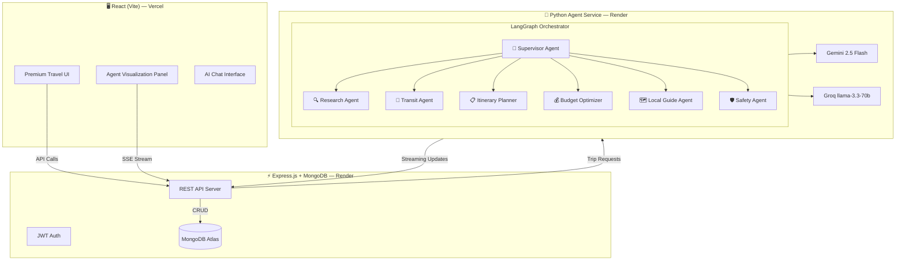

# 🚀 VoyageAI — MERN + Python Agentic AI Migration Plan

## Architecture Overview



## 🤖 Agent Roles (7 Agents)

| Agent | Role | Tools | Impressive For |
|-------|------|-------|----------------|
| **🧠 Supervisor** | Orchestrates all agents, manages state | Agent delegation, state management | Shows multi-agent coordination |
| **🔍 Research Agent** | Gathers destination intel, weather, culture | Web search, knowledge base | Shows tool-use capabilities |
| **🚂 Transit Agent** | Finds trains, flights, road routes | Transit DB, distance calc, scheduling | Shows structured data reasoning |
| **📋 Itinerary Planner** | Builds day-by-day plans with time slots | Calendar logic, activity DB | Shows planning & constraint solving |
| **💰 Budget Optimizer** | Allocates budget, finds deals, contingency | Price estimation, budget math | Shows optimization reasoning |
| **🗺️ Local Guide** | Recommends hidden gems, local food, tips | Local knowledge, ratings | Shows personalization |
| **🛡️ Safety Agent** | Travel advisories, health tips, scam alerts | Safety DB, advisory APIs | Shows responsible AI |

## 📁 New Project Structure

```
Trip_planner/
├── client/                    # React (Vite) Frontend
│   ├── src/
│   │   ├── components/        # Existing UI components (migrated)
│   │   ├── pages/             # React Router pages
│   │   ├── hooks/             # Custom hooks
│   │   ├── services/          # API service layer
│   │   └── store/             # State management
│   ├── package.json
│   └── vite.config.ts
│
├── server/                    # Express.js Backend
│   ├── src/
│   │   ├── routes/            # API routes
│   │   ├── models/            # Mongoose schemas
│   │   ├── middleware/        # Auth, CORS, etc.
│   │   ├── services/          # Business logic
│   │   └── config/            # DB connection, env
│   ├── package.json
│   └── tsconfig.json
│
├── agents/                    # Python Agentic AI Service
│   ├── app/
│   │   ├── main.py            # FastAPI server
│   │   ├── agents/
│   │   │   ├── supervisor.py  # LangGraph supervisor
│   │   │   ├── research.py    # Research agent
│   │   │   ├── transit.py     # Transit agent
│   │   │   ├── itinerary.py   # Itinerary planner
│   │   │   ├── budget.py      # Budget optimizer
│   │   │   ├── local_guide.py # Local guide agent
│   │   │   └── safety.py      # Safety agent
│   │   ├── tools/             # Agent tools
│   │   ├── models/            # Pydantic schemas
│   │   └── config/            # LLM provider config
│   ├── requirements.txt
│   └── Dockerfile
│
└── README.md
```

## 🔄 Migration Steps

### Phase 1: Project Scaffolding
- Create `client/`, `server/`, `agents/` directories
- Set up Vite + React + React Router
- Set up Express + Mongoose + MongoDB Atlas
- Set up Python FastAPI + LangGraph

### Phase 2: Backend (Express + MongoDB)
- Mongoose models: User, Trip, Conversation
- Auth routes (register, login, me)
- Trip CRUD routes
- Agent proxy endpoint (forwards to Python service)

### Phase 3: Python Agentic AI
- LangGraph state machine with 7 agents
- Gemini + Groq dual-provider with fallback
- SSE streaming for real-time agent status updates
- Each agent has specific tools and responsibilities

### Phase 4: Frontend Migration
- Convert Next.js pages to React Router
- Add Agent Visualization panel (shows which agent is working)
- Real-time streaming of agent thoughts/progress
- Keep existing premium UI design

### Phase 5: Deployment
- Frontend → Vercel
- Express Backend → Render.com
- Python Agents → Render.com
- MongoDB → Atlas (free tier)

> [!IMPORTANT]
> The **Agent Visualization Panel** is the portfolio showpiece — it shows each agent's status, thoughts, and handoffs in real-time as they collaborate to build the trip.
